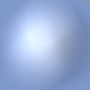
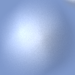
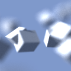
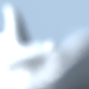
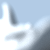

# CSE 274 Final Report: Fourier Depth of Field

## Group Members

* Ziyang Li, A92070182
* Ziqi Gan, A91047610

## Paper Specification

#### Fourier Depth Of Field, TOG 2009

* Cyril Soler, INRIA, Grenoble University, CNRS
* Kartic Subr, UC Irvine
* Frédo Durand, MIT CSAIL
* Nicolas Holzschuch & François Sillion, INRIA, Grenoble University, CNRS

## Abstract

In this quarter we implemented the Fourier Depth of Field paper by prof. Cyril
Soler from INRIA. In this implementation we are mainly focusing on ideas of
how to use Fourier spectrum to analyze the aperture effect and do prediction
on sample amount to adaptive sample the scene to improve efficiency. By the end
we are able to generate some very interesting results, and the adaptive sampling
method does work pretty well.

> Notice that in the milestone specification we also mentioned the Layered Light
Field Reconstruction paper. But unfortunately we did only figure out how to do
the Fourier Depth of Field one. So we abandoned the idea of also implementing
that paper.

<center>
    <div style="width: 45%; display: inline-block;">
        ![cubes_fdof_100_50000_2]
    </div>
    <div style="width: 45%; display: inline-block;">
        ![dragon_fdof_100_20000_1]
    </div>
</center>

## Algorithms

The algorithm is an A-Priori adaptive sampling algorithm that splat the samples
based on two observations:

1. The out-of-focus area doesn't require profuse sampling on image space.
2. The in-focus regions doesn't require profuse sampling on the aperture.

Based on these two observations, we want to analyze the image plane frequency
distribution as well as lens (aperture) frequency. And by using Hierarchical
Importance Sampling (Victor et al, 2004), we are able to generate sparse image
samples. Finally we are going to use reconstruction to resemble the whole image
from the sparse samples to make the lens blur smoother.

So the whole pipeline is like this:

1. Light Field Propagation and Fourier Analysis
2. Path Tracing from Sparse Samples
3. Reconstruction

In the following sections we are going to elaborate on our individual
algorithms implementation.

### 1: Light Field Propagation and Fourier Analysis

Still, we are going to divide this process into several sub-stages. In the
following paragraphs we are going to talk about specific implementations

#### 1.1. Generate Primary Rays

This part is pretty simple. The *Primary Ray*, as described in the original
paper, is the center ray corresponding to each pixel in the image plane. There's
no aperture sampling corresponding to this part. So the algorithm looks like
the following:

``` c++
for (int j = 0; j < height; j++) {
    for (int i = 0; i < width; i++) {
        vec2 imgsp = vec2((i - hw + 0.5) / hw, (j - hh + 0.5) / hh);
        samples.push_back(RaySample(i, j, imgsp));
    }
}
```

Note that the `RaySample` usually contains an additional `vec2 apertureSample`,
but here we are only doing depth tracing and only need camera rays. So we use
pinhole camera and the `apertureSample` is set to default `{0, 0}`.

Building up from that, we trace the generated `RaySample`. This part is
also pretty simple. After this we are going to obtain a vector of
`Intersection`, which stores the depth, objects, position, normals and all kinds
of informations.

``` c++
Ray ray = cam.getRay(samples[i].imageSample);
Intersection intersect(ray);
scene.intersect(ray, intersect);
```

#### 1.2. Get the Circle of Confusion

Based on the `Intersection` information we get from 1.2, we are going to
calculate the radius of circle of confusion corresponding to each Intersection.
The radius of circle of confusion is critical in the later Fourier Analysis,
because we do need a set of occluders to do convolution on the Fourier Spectrum.

First, the circle of confusion is corresponding to the camera aperture, and is
also related to the distance from the scene point to camera. Given that the
circle of confusion is just **zero** when the point is on the focal plane, we
can derive a formula based on Similar Triangle Theorems:

``` c++
vec3 f = normalize(cam.target() - cam.position());
float dp = length(dot(position - cam.position(), f) * f);
return abs(cam.focalDistance() - dp) / dp * cam.aperture();
```

Note that this is the case when the intersection actually exists (the ray has
a hitting point in the scene). There is another situation that the ray never
hit on any object, so that way we can think of the ray hitting a point that
is infinitely far away. So therefore we just plug infinity into the formula
above, and we get exactly `cam.aperture()`.

The following image shows the radius of circle of confusion for each pixel. The
white values are mapped to 50 in pixels, while the black values are just 0.

<center>![alt coc][coc]</center>

#### 1.3. Propagate the Light Field Spectra

When we have the information of Circle of Confusion, we can finally actually
come to light field propagation. There are are also four sub-stages in
propagating light fields:

##### 1.3.1. Spectrum Structures & Generation

In our definition, we are using samples to approximate light field spectrum. The
whole spectrum is as simple as an array of 2d vectors: `std::vector<vec2>`. Note
that the paper does mentioned that the original samples should consider full 2d
spatial frequency as well as 2d angular frequency. But since in this
implementation we are only going to deal with maximum bandwidth and variance,
so it is ok to project the 4d vector to 2d, while the 2d spatial frequency is
mapped to the frequency of distance from the ray to the primary ray, and the
2d angular frequency is mapped to the frequency of the angles formed between
light field ray and primary ray.

The angles could be any number that is `< pi / 2`. So it is pretty
straightforward. But in terms of the spatial frequency, theoretically, it could
be any number ranging from `-inf` to `inf`. In practice, as the paper proposed,
since the spectrum will eventually be aperture filter bounded, they use a
conservative estimation. In our implementation, we used `{-10, 10}` which
produced pretty good estimations.

``` c++
for (int i = 0; i < num; i++) {
    samples.push_back(vec2(random() * 20 - 10, random() * pi - pi / 2));
}
```

##### 1.3.2. Occlusion Check

Although the transport part is much easier, our transport actually comes after
doing all the occlusion check. In this part, for each pixel, we need to find
all the discontinuities that is within its circle of confusion (obtained in 1.2)
and sort them incrementally. These discontinuities will be further called
occluders. For all of these occluders, we need to do convolutions on them.

> Note that in the original paper they mentioned an `omega_x` where we couldn't
find. So we tried lots of variations and finally we found that `pi` is a pretty
good value to use.

The discontinuity check is done analyzing the double cone presented in the
paper. By formulating the problem in a more precise way, we come up with the
following code to check the discontinuity:

``` c++
float dp = dot(p - c, f), dq = dot(q - c, f);
float ap = (dp - dq) / dp * cam.aperture();
vec3 pp = c + (p - c) * dq / dp;
return length(q - pp) < ap;
```

`p` and `q` are positions in the scene, and the finally returned bool value
will indicate whether there is a discontinuity between `p` and `q`. Note that
in this specific situation, the two pixels must at the same time hit some point
in the scene. There are also other logics that deal with no intersection
situations.

Given this discontinuity, we are going to affect that into its whole circle of
confusion area (obtained in 1.2).

##### 1.3.3 Propagation

After 1.3.2 we have built up an occluder list for every pixel. We sort the
occluders from front to back, and then we can do occlusion (convolution on
samples) and transport:

``` c++
float prev = 0;
for (int o = 0; o < occluders.size(); o++) {
    spctm.transport(prev - occluders[o]);
    spctm.occlude(pi);
    prev = occluders[o];
}

if (itsct.hit) {
    spctm.transport(prev - itsct.t);
}
```

The basic logic is just, transport to the next occluder, and be occluded, and
then transport to the next occluder, and so on and so forth. By the end of this
process, we are going to finally transport the spectrum to its hit position (if
hit). Then we get the whole spectrum propagated.

The specific `occlude` and `transport` method is shown here:

Transport method is just a shear in the angular domain:

``` c++
void Spectrum::transport(float dist) {
    for (int i = 0; i < samples.size(); i++) {
        samples[i].y += samples[i].x * dist;
    }
}
```

The occlusion is using randomization between `-1 / ox`, `0`, and `1 / ox` to
simulate the convolution in the spatial domain:

``` c++
void Spectrum::occlude(float ox) {
    for (int i = 0; i < samples.size(); i++) {
        samples[i].x += 1 / ox * (floor(mod(random(), 1.0f) * 3.0f) - 1.0f);
    }
}
```

The result of this process is shown in the following image. We have every
spectrum output to a image, and here you can see some of them got occluded a lot
(meaning that it is very wide in spatial domain). And some of them got
transported a lot while still kept its base shape.

<center>![alt spectra][spectra]</center>

##### 1.3.4 Lens Density

The Lens Density is obtained by obliquely all the samples to the angular axis by
a slope of focal distance and calculate the variance from it. This is especially
reasonable because if there's a point lies exactly on the focal plane, then the
spectrum will be sheared by focal distance. After applying the lens projection,
the samples will go back to small values and hence the point on the focal plane
has very small variance. The following code shows how we calculate the variance.

``` c++
float Spectrum::getVariance(float focalDistance) {
    float acc = 0;
    for (int i = 0; i < samples.size(); i++) {
        float v = samples[i].y + focalDistance * samples[i].x;
        acc += v * v;
    }
    return acc / samples.size();
}
```

The reason we want to compute the lens density is based on the *Observation 2:
The in-focus regions doesn't require profuse sampling on the aperture.* The
in-focus region, as described in the previous paragraph, has very small
variance. Hence we don't need that much aperture samples. So we introduce a
mapping between the variance we compute and the actual sample we shoot (`ns`):

``` c++
int ns = (int) ceil(k * pow(variance, 0.66667f));
```

Note that `k` is a instance variable associate with the FDOF Path Tracer Engine.
We use this parameter to manually adjust the sample amount we want to shoot out.
Since the `variance` will be mainly ranged from `0` to `20` and while some
exceptionally complicated area will have a `variance` over `100`. If we want a
normally good render, a `k` of `10` would suffice. But if we want a really good
one, then a `k` of `100` would be absolutely needed.

The following image shows a lens density plot for the image. The white area
indicates high spectrum variance.

<center>![alt lens_density][lens_density]</center>

##### 1.3.5 Obtain the Spatial Density

The spatial density is then obtained by doing an aperture filter along with a
maximum extraction of angular axis. This maximum angular bandwidth of spectrum
shows the spatial density of the pixel. We want to compute the spatial density
because of the *Observation 1: The out-of-focus area doesn't require profuse
sampling on image space.* This is particularly interesting because when we
introduce Hierarchical Importance Sampling in the next section, you will
actually see that the blurred out areas are sampled sparsely, and hence enabling
us to do reconstruction which would be smooth and producing very noise-freed
results.

The aperture filter is applied as follows:

``` c++
void Spectrum::filterAperture(float aperture, float focalDistance) {
    for (int i = samples.size() - 1; i >= 0; i--) {
        if (std::abs(samples[i].y + focalDistance * samples[i].x) > pi / 2) {
            samples.erase(samples.begin() + i);
        }
    }
}
```

We will erase the samples that lies outside of the aperture spectrum. While
obtaining the maximum bandwidth of the them is trivial:

``` c++
float Spectrum::getMaximumBandwidth() {
    if (samples.size() > 0) {
        float maximum = std::abs(samples[0].y);
        for (int i = 1; i < samples.size(); i++) {
            maximum = std::max(maximum, samples[i].y);
        }
        return maximum;
    }
    else {
        return 0;
    }
}
```

After this process, we will have the maximum bandwidth of each pixel. The
following image shows the maximum bandwidth estimation. The white area indicates
high bandwidth (thus high spatial density).

<center>![alt spatial_density][spatial_density]</center>

##### 1.3.6 Obtain the Sample Points

We will generate the sampling points using the Hierarchical Importance Sampling
method proposed by Victor et al, 2004, in the paper
[Hierarchical Importance Sampling](https://cseweb.ucsd.edu/~ravir/6160/papers/importancesampling.pdf).
We read through the paper and was about to implement it ourselves, but it is
very lucky that we directly found the code they provided
[here](http://www-labs.iro.umontreal.ca/~ostrom/ImportanceSampling/example-code/)
We adapt the code into our method immediately and it is fast enough for us to
generate very good result.

We still need to introduce a mapping from the maximum bandwidth we obtained from
section 1.3.5 to the `importance` term that Hierarchical Importance sampling
requires: `ρ(s) = 4 * energy ^ 2 * fovx * fovy / (W * H)`, where the energy
term is given by the maximum bandwidth. Note that other then `energy ^ 2` all
the other terms are constants across image. So we use a single `energy` term
to get `ρ(s)`. In our implementation it looks like this:

``` c++
ps = e * (i * energy * energy);
```

Note that `i` is an importance term used to differentiate between a hit point
and a non-hit point. The non-hit point is going to have `i * energy * energy`
term exactly `1`. The `e` term is an exaggerator for getting the final
importance for Hierarchical Importance Sampling. After trying a lot of
combinations out, it would be best if we loosen the difference between hit point
and non-hit points by setting `i` to `1` and promote empty area sampling by set
`e` to `10000` or even `50000`.

The following image shows a sampling points graph. The white area means that
we are going to shoot at least a sample to the scene.

<center>![alt samples][samples]</center>

### 2: Path Tracing

We are just using the original path tracer to do this part, Just using a slight
different sample feeder.

> Note: We must mention that in this project we want to enhance the object
oriented structure and promote comparability between the regular path tracer
and FDOF path tracer. Since in the regular path tracer it would be very easy to
do parallel computing but in the FDOF path tracer the cache hit pattern is very
messy. So we use the same kind of stream sample feeder to provide samples

After doing the path tracing, we obtain a image like this. You can see that for
every white dot in the above generated samples image, there's a color associated
to it now.

<center>![alt path_traced_samples][path_traced_samples]</center>

### 3: Reconstruction

In this section we are going to talk about our work on how to reconstruct the
above sparsely sampled image to a full image. We actually had a hard time doing
this and even after trying lots of methods we are still doing additional work
to try new reconstruction methods.

Here is a list of methods we used:

1. Calculate the gaussian weighted average of all the colored neighbors that
lay within a given radius.
2. Find a constant `k` number of nearest neighbors and use a varied variance
to calculate the gaussian weighted average
3. Find a flexible `k_s` number of nearest neighbors (depending on its circle
of confusion) and calculate the gaussian weighted average based on fixed
variance.
4. (Combination of 2 and 3) Flexible `k_s` number of nearest neighbors and a
varied variance using the largest radius these `nearest neighbors` give us.
5. Find the smallest triangle that covers the current pixel and do linear
interpolation for this pixel.

We are still implementing 5 in the mean time, and we are sticking with 4 cause
it produces currently the best result, but still with some small unwanted
artifact. I currently believe that 5 will be a little better for a more general
case, given that the background is also sampled little denser.

Note that the reconstruction process is definitely related to the samples we
generate from 1.3.6. If we don't have the importance a minimal of 1 or the
`e` term is not big enough, then the background area will be very very sparse
which leads to super bad artifacts.

<center>![alt reconstructed][reconstruct]</center>

## Result & Benchmark

For this project we mainly build two test scenes. The first one is the cube
scene and the second one is the dragon scene. We are then going to show our
time benchmark and detailed comparison with ground truth image. For the cubes
one our work is also comparable to the original work done by Soler et al, 2009.
Here is our results.

### Cube Scene

For the cubes one, we rendered some naive path traced images that has time
comparable to the one done using our method. We also used path tracer to render
a 1000 spp image that we can compare to.

This is a table of what we get under different parameter setup:

| Parameters | Before Reconstruction | After Reconstruction |
|------------|-----------------------|----------------------|
| k: 100 <br /> e: 10000 <br /> i: 1 | ![cubes_fdof_100_10000_1_itmdat] | ![cubes_fdof_100_10000_1] |
| k: 50 <br /> e: 50000 <br /> i: 1 | ![cubes_fdof_50_50000_1_itmdat] | ![cubes_fdof_50_50000_1] |
| k: 100 <br /> e: 50000 <br /> i: 2 | ![cubes_fdof_100_50000_2_itmdat] | ![cubes_fdof_100_50000_2] |

You can see that when `e` is set to `10000`, the background is sampled very
sparsely, resulting in the final image over-blurred in clear region. The bigger
`e` is, the more samples are there in the scene. Meanwhile, the `k` value is
also determine the accuracy of each pixel. By comparing the second one with the
third one, we can see that the third one is perceivably smoother.

In terms of time analysis, the first costs 46s, the second is also 50s, while
the third one is taking much longer time, 131s.

But then let's compare these results to the Path Traced Results. I did rendered
a 1000 spp "Ground Truth" image:

|       | FDOF (Our Method) | Path Trace (1000 spp) |
|-------|-------------------|------------|
| Image | ![cubes_fdof_100_50000_2] | ![cubes_gt_1000] |
| Parameters | k: 100 <br /> e: 50000 <br /> i: 2 | spp: 1000 |
| Total Sample Amount | 140500415 | 307200000 |
| Render Time | 131.72s | 157.24s |
| Detailed Render Time | Scene Analysis: 20.24s <br /> Path Tracing: 107.55s <br /> Reconstruction: 3.93s | Not Applicable |

It is absolutely visible that in the foreground and background area path tracer
still have lots of noise, while in FDOF there's very little (though it still
has reconstruction artifacts). In the in-focus area, the regular Path Tracer is
better since it shoots 1000 rays to the in-focus area but the FDOF tries to
pay less attention to that part – in this case we are only shooting around 100
samples (according to `k`).

It is noticeable that even we have half the amount of the 1000 spp path traced
one, we are still consuming a time pretty close to that. This is because almost
all the samples we cast to the scene are going towards an area that has
intersections. And even though the path tracer casts out 300M rays, most of them
are going towards the empty area (in this particular image there are almost 50%
of the pixels that are pure background color).

Here is a detailed comparison of the small area between these two pictures:

| FDOF (Our Method) | Path Trace (1000 spp) |
|-------------------|------------|
|  |  |
|  |  |

### Dragon Scene

We are also going to compare the results between dragons rendered by our method
and the "Ground Truth" one rendered by simple Path Tracer (1000 spp).

|       | FDOF (Our Method) | Path Trace (1000 spp) |
|-------|-------------------|------------|
| Image | ![dragon_fdof_100_20000_1] | ![dragon_gt_1000] |
| Parameters | k: 100 <br /> e: 20000 <br /> i: 1 | spp: 1000 |
| Total Sample Amount | 102156472 | 307200000 |
| Render Time | 3012.73s | 5395.59s |
| Detailed Render Time | Scene Analysis: 4.09s <br /> Path Tracing: 3003.97s <br /> Reconstruction: 4.67s | Not Applicable |

Here is a detailed comparison of the high frequency area between these two
pictures:

| FDOF (Our Method) | Path Trace |
|-------------------|------------|
|  |  |

It is definitely perceivable that in the edge area, path tracer is producing
more noise. Given that our method have actually taken less time, we definitely
outperform the original method.

Meanwhile, the reconstruction artifact is still visible when zoomed in. This is
definitely a thing we need to future fix.

## Limitations

We do have some limitations in this method.

1. Hard to predict the final sample amount. Before the full sample amount come
out we need to wait for 10 to 20 seconds, and from there we can then adjust our
parameters and do another analysis. While using Path Tracer you can infer the
total sample amount just by multiplying width, height and spp together.

2. The reconstruction artifact is hard to eliminate. We are still trying out
the triangle and interpolation method. Hope it will work somehow.

3. Doesn’t take into account for non-lambertian materials. Currently all the
estimation is very conservative.

## Future Works

1. Finish the triangle and interpolation reconstruction method.
2. Do spectrum generation to non-lambertian materials.
3. Optimize sample generation speed and use parallel programming with batches.

## Conclusion

It is also noticeable that when we got stucked I sent out an email to prof.
Soler and got replied from him. Saying that this is one of the earliest work
so there are a lot of assumptions that are very conservative. From there on they
have developed more precise algorithms to do better prediction on sample amount.
But this is a really good project to do and I really learnt a lot in terms of
Fourier and Light Field Analysis.

[coc]: res/final/coc.png
[spectra]: res/final/spectra.png
[lens_density]: res/final/lens_density.png
[spatial_density]: res/final/spatial_density.png
[samples]: res/final/samples.png
[path_traced_samples]: res/final/path_traced_samples.png
[reconstruct]: res/final/reconstructed.png
[cubes_fdof_100_10000_1_itmdat]: res/final/cubes_fdof_50_50000_1_itmdat.png
[cubes_fdof_100_10000_1]: res/final/cubes_fdof_50_50000_1.png
[cubes_fdof_50_50000_1_itmdat]: res/final/cubes_fdof_50_50000_1_itmdat.png
[cubes_fdof_50_50000_1]: res/final/cubes_fdof_50_50000_1.png
[cubes_fdof_100_50000_2_itmdat]: res/final/cubes_fdof_100_50000_2_itmdat.png
[cubes_fdof_100_50000_2]: res/final/cubes_fdof_100_50000_2.png
[cubes_gt_1000]: res/final/cubes_gt_1000.png
[dragon_fdof_100_20000_1]: res/final/dragon_fdof_100_20000_1.png
[dragon_gt_1000]: res/final/dragon_gt_1000.png
